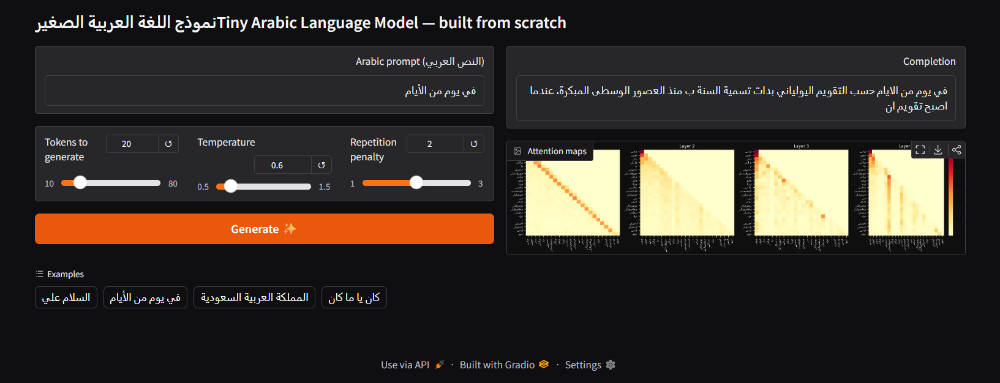
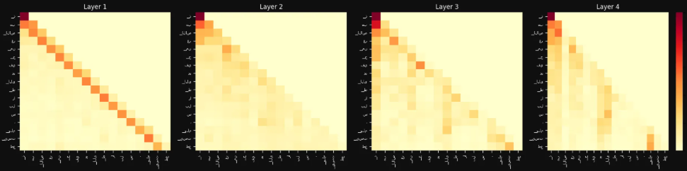
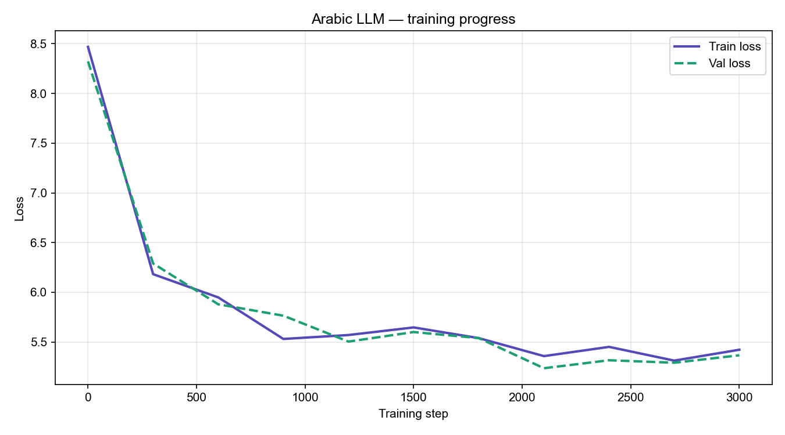
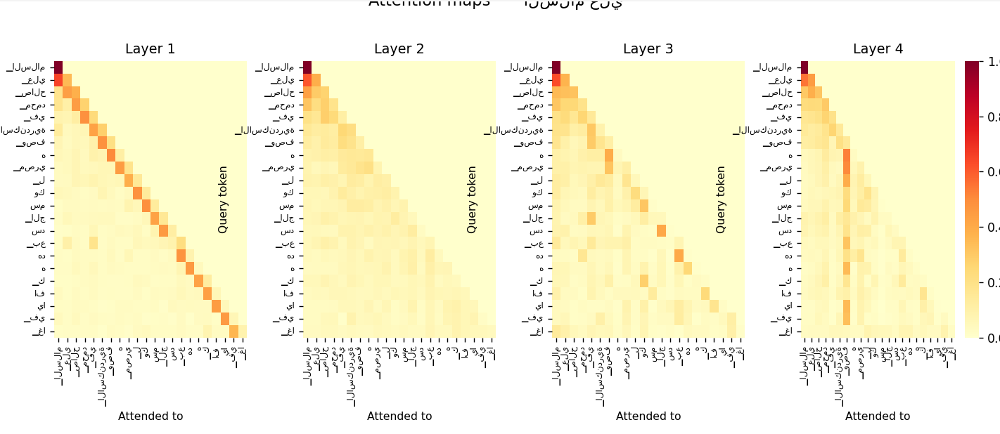

# 🧠 Tiny Arabic LM — From Scratch

> A small Arabic language model built entirely from scratch using PyTorch — no pre-trained weights, no Hugging Face models. Just math, code, and Arabic text.



---

## 📌 What is this?

This project implements a **character-aware Arabic language model** trained on Arabic Wikipedia. Given the beginning of an Arabic sentence, the model completes it word by word inspired by the same autoregressive transformer principles used in GPT-style models, just smaller and fully transparent.

Everything is built from the ground up:
- A **BPE tokenizer** trained on Arabic text using SentencePiece
- A **transformer model** with multi-head self-attention, written in pure PyTorch
- An **attention visualization** system showing what the model focuses on
- A **Gradio web demo** you can run locally in your browser

---

## ✨ Demo

| Prompt | Completion |
|---|---|
| `السلام علي` | `السلام علي جميع المسلمين في أرجاء العالم` |
| `في يوم من الأيام` | `في يوم من الأيام كان هناك رجل يعيش في قرية` |
| `المملكة العربية السعودية` | `المملكة العربية السعودية دولة تقع في شبه الجزيرة العربية` |



---

## ⚠️ Current limitations

Because the model is intentionally small (~1.7M parameters) and CPU-trained,
generated text can still become repetitive or lose long-range coherence.

This project focuses more on understanding and implementing transformer
architectures than achieving state-of-the-art Arabic generation quality.

---

## 🏗️ Architecture

```
Input text (Arabic)
       │
       ▼
┌─────────────────┐
│  BPE Tokenizer  │  vocab_size = 4,000 tokens
│  (SentencePiece)│
└────────┬────────┘
         │  token IDs
         ▼
┌─────────────────┐
│ Token Embedding │  (vocab_size → 256)
│  + Pos Embedding│  (block_size → 256)
└────────┬────────┘
         │
         ▼
┌─────────────────┐  ┐
│  Layer Norm     │  │
│  Multi-Head     │  │  × 4 layers
│  Attention (×4) │  │
│  Layer Norm     │  │
│  Feed Forward   │  │
└────────┬────────┘  ┘
         │
         ▼
┌─────────────────┐
│  Layer Norm     │
│  Linear Head    │  (256 → vocab_size)
└────────┬────────┘
         │
         ▼
  Next token prediction
```

### Model specs

| Parameter | Value |
|---|---|
| Vocabulary size | 4,000 tokens |
| Embedding dimension | 256 |
| Attention heads | 4 |
| Transformer layers | 4 |
| Context window | 128 tokens |
| Total parameters | ~1.7M |
| Training hardware | CPU only |
| Training time | ~40 minutes |

---

## 📉 Training Metrics



| Step | Train Loss | Val Loss |
|---|---|---|
| 0 | 8.29 | 8.29 |
| 1000 | 6.11 | 6.08 |
| 2000 | 5.61 | 5.58 |
| 3000 | 5.43 | 5.41 |
| 4000 | 5.38 | 5.37 |
| 5000 | 5.34 | 5.34 |

> Starting loss ~8.3 is the theoretical maximum for a 4,000-token vocabulary (`ln(4000) ≈ 8.29`). Dropping to ~5.3 confirms the model learned real Arabic patterns.

---

## 🔍 Attention Visualization

The model exposes attention weights from all 4 layers after every forward pass.



**What the maps show:**
- **Layers 1–2** — strong diagonal pattern: each token attends heavily to itself and immediate neighbors (local syntax)
- **Layers 3–4** — more distributed attention across the full sequence (longer-range semantic relationships)

This matches the behavior observed in much larger transformer models like GPT-2.

---

## 📁 Project Structure

```
tiny-arabic-llm/
│
├── data/                    # generated — not committed to git
│   ├── arabic_raw.txt
│   ├── arabic_clean.txt
│   ├── train.pt
│   └── val.pt
│
├── tokenizer/               # generated — not committed to git
│   ├── arabic.model
│   └── arabic.vocab
│
├── model/                   # generated — not committed to git
│   ├── arabic_lm.pt
│   └── losses.pt
│
├── screenshots/             # committed — for README
│
├── data.py                  # download Arabic Wikipedia data
├── clean.py                 # clean and normalize Arabic text
├── tokenizer.py             # train BPE tokenizer + encode dataset
├── model.py                 # transformer architecture (pure PyTorch)
├── train.py                 # training loop
├── plot.py                  # loss curve visualization
├── visualize.py             # attention heatmaps
├── generate.py              # CLI sentence completion
├── demo.py                  # Gradio web demo
│
├── .gitignore
└── README.md
```

---

## 🚀 Run it yourself

### 1. Clone and install

```bash
git clone https://github.com/YOUR_USERNAME/tiny-arabic-llm
cd tiny-arabic-llm
python -m venv venv
venv\Scripts\activate        # Windows
# source venv/bin/activate   # Mac/Linux
pip install -r requirements.txt
```

### 2. Collect and prepare data

```bash
python step1_data.py         # download 50k Arabic Wikipedia articles
python step2_clean.py        # normalize Arabic text
python step3_tokenizer.py    # train tokenizer + encode dataset
```

### 3. Train the model

```bash
python train.py              # ~40 min on CPU
python plot.py               # view loss curve
```

### 4. Generate text

```bash
python generate.py           # complete Arabic sentences in terminal
```

### 5. Launch the web demo

```bash
python demo.py               # opens at http://127.0.0.1:7860
```

---

## 🧪 Key concepts implemented

| Concept | Where |
|---|---|
| Byte Pair Encoding (BPE) | `tokenizer.py` |
| Token + positional embeddings | `model.py → ArabicLM` |
| Scaled dot-product attention | `model.py → Head` |
| Multi-head attention | `model.py → MultiHeadAttention` |
| Residual connections | `model.py → Block` |
| Layer normalization | `model.py → Block` |
| Cross-entropy language model loss | `model.py → ArabicLM.forward` |
| AdamW optimizer | `train.py` |
| Temperature + repetition penalty sampling | `generate.py`, `demo.py` |
| Attention weight extraction + visualization | `visualize.py` |

---

## 🛠️ Requirements

```
torch
datasets
sentencepiece
matplotlib
seaborn
gradio
tqdm
Pillow
```

Install all at once:
```bash
pip install torch datasets sentencepiece matplotlib seaborn gradio tqdm Pillow
```

Or generate the file yourself:
```bash
pip freeze > requirements.txt
```

---

## 💡 What I learned

- How transformers actually work at the matrix level — not just conceptually
- Why Arabic NLP needs special handling (RTL, diacritics, alef normalization)
- The difference between tokenization strategies (char-level vs BPE)
- What attention weights actually represent and how to read heatmaps
- How loss behaves during training and what plateauing looks like
- How to go from raw text → trained model → web demo end to end

---

## 📚 References

- [Attention Is All You Need](https://arxiv.org/abs/1706.03762) — Vaswani et al., 2017
- [Andrej Karpathy's nanoGPT](https://github.com/karpathy/nanoGPT) — architectural inspiration
- [Arabic Wikipedia via Wikimedia](https://huggingface.co/datasets/wikimedia/wikipedia) — training data
- [SentencePiece](https://github.com/google/sentencepiece) — tokenizer library

---

## 👤 Made By

[Lujain]
[LinkedIn](https://www.linkedin.com/in/lujain-abdulrahman/) · [Email](lujainlug@gmail.com)

---

*Built from scratch — no pre-trained models were used.*
